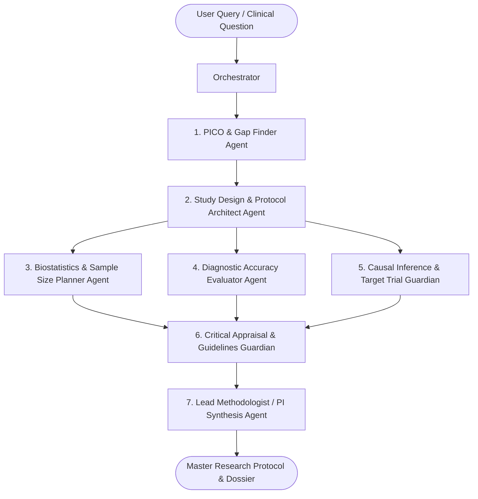

# 🩺 Medical Research & Methodology Multi-Agent AI System

ระบบปัญญาประดิษฐ์สถาปัตยกรรมหลายเอเจนต์ (**Multi-Agent AI Architecture**) สำหรับการออกแบบระเบียบวิธีวิจัยทางการแพทย์ การวิเคราะห์ชีวสถิติ การประเมินชุดตรวจวินิจฉัย และการอนุมานเชิงสาเหตุในเวชระเบียนโลกจริง (Real-World Evidence)

> 🏛️ **ฐานข้อมูลและกรอบแนวคิดอ้างอิง:** พัฒนาขึ้นโดยอ้างอิงเนื้อหาจากหลักสูตร **Data and Data Analytics in Digital Health** (หน่วยบริหารจัดการข้อมูล ปัญญาประดิษฐ์ และชีวสถิติ: **DAB Unit**, ฝ่ายวิจัย คณะแพทยศาสตร์ จุฬาลงกรณ์มหาวิทยาลัย โดย อ.ดร.นพ.อมริศ ตันสัจจา) ร่วมกับตำรามาตรฐานสากล:
> - *Clinical Epidemiology: The Essentials* (Robert H. Fletcher & Suzanne W. Fletcher)
> - *Biostatistics: A Foundation for Analysis in the Health Sciences* (Wayne W. Daniel, 9th ed.)
> - *Causal Inference & Target Trial Emulation Framework* (Judea Pearl, Miguel Hernán & James Robins)

---

## 🚀 1. ติดตั้งและใช้งานผ่าน npm ได้ทันที (Zero-Dependency Node.js & npx)

**ไม่ต้องใช้ `pip install` หรือตั้งค่า Python venv ใดๆ!** ระบบรองรับการติดตั้งและรันผ่าน `npm` / `npx` โดยตรงจาก GitHub:

### วิธีที่ 1: รันด่วนทันทีผ่าน `npx` (ไม่ต้องติดตั้งลงเครื่อง)
```bash
npx github:Bravetrunk/medical-research-multiagent "In adult patients with heart failure, does dapagliflozin reduce cardiovascular death compared with standard of care?"
```

### วิธีที่ 2: ติดตั้งผ่าน `npm install` จาก GitHub
```bash
# ติดตั้งไว้ในโปรเจกต์ของคุณ
npm install github:Bravetrunk/medical-research-multiagent

# หรือติดตั้งเป็นคำสั่งระดับเครื่อง (Global CLI)
npm install -g github:Bravetrunk/medical-research-multiagent

# เรียกใช้คำสั่งได้ทันที
medical-research "In patients with CKD, does SGLT2i reduce ESRD?"
```

### วิธีที่ 3: เรียกใช้เป็นไลบรารีใน Node.js / TypeScript
```javascript
const { MedicalResearchOrchestrator } = require('medical-research-multiagent');

const orchestrator = new MedicalResearchOrchestrator();
const state = orchestrator.runPipeline(
  "In adult type 2 diabetes patients, does semaglutide reduce stroke compared with placebo?"
);

console.log(state.pico);
console.log(state.studyDesign);
console.log(state.biostatsPlan);
console.log(state.markdownReport);
```

---

## 🐍 2. รองรับ Python SDK ด้วยเช่นกัน (Dual-Stack)

สำหรับผู้ใช้งานสาย Python ยังคงสามารถใช้งาน CLI และโมดูล Python ได้ตามปกติ:
```bash
git clone https://github.com/Bravetrunk/medical-research-multiagent.git
cd medical-research-multiagent
python cli/main.py "Your clinical research question"
```

---

## 🤖 3. การนำไปใช้งานร่วมกับ AI Agents & IDEs (Claude Code, Antigravity, Grok, Codex, Cursor)

คุณสามารถนำระบบ Medical Research Multi-Agent ไปติดตั้งเป็น **Native Tool / MCP Server** ใน AI Agents ชั้นนำได้ทันที:

### 🔹 Claude Code (Anthropic CLI)
เชื่อมต่อผ่าน Model Context Protocol (MCP) ด้วยคำสั่งเดียว:
```bash
claude mcp add medical-research -- npx -y -p github:Bravetrunk/medical-research-multiagent medical-research-mcp
```
*(ใน Repo มีไฟล์ [`CLAUDE.md`](./CLAUDE.md) พร้อมใช้งาน ทำให้ Claude Code รันคำนวณและตรวจสอบระเบียบวิธีวิจัยได้อัตโนมัติ)*

### 🔹 Google Antigravity (AGY)
ติดตั้งเป็น Antigravity Skill และ MCP Server:
```bash
mkdir -p ~/.gemini/config/skills/medical-research-methodology
cp skill/SKILL.md ~/.gemini/config/skills/medical-research-methodology/SKILL.md
```
Antigravity จะตรวจจับคำถามด้าน Clinical Epidemiology, RCT, Biostatistics และเรียกใช้เอเจนต์อัตโนมัติ

### 🔹 Cursor & Windsurf
1. ใน **Cursor Settings** $\to$ **Features** $\to$ **MCP** $\to$ **+ Add New MCP Server**:
   - Name: `medical-research`
   - Command: `npx -y -p github:Bravetrunk/medical-research-multiagent medical-research-mcp`
2. มีไฟล์ [`.cursorrules`](./.cursorrules), [`.cursor/rules/medical-research.mdc`](./.cursor/rules/medical-research.mdc) และ [`.windsurfrules`](./.windsurfrules) รวมอยู่ใน Repo เรียบร้อยแล้ว

### 🔹 xAI Grok & OpenAI Codex / ChatGPT
- **Function Calling API**: รองรับทั้ง Grok API (`api.x.ai/v1`) และ OpenAI GPT-4o / Codex ผ่านไฟล์ Schema [`integrations/openai_grok_tools.json`](./integrations/openai_grok_tools.json) และตัวอย่างโค้ดรันได้จริงใน [`integrations/openai_grok_agent.py`](./integrations/openai_grok_agent.py)
- **ChatGPT Custom GPT Action**: นำไฟล์ [`integrations/openapi.json`](./integrations/openapi.json) ไปวางในช่อง Actions ของ GPT Builder ได้ทันที

### 🔹 Agent Frameworks (CrewAI, LangGraph, Vercel AI SDK)
- CrewAI: [`integrations/crewai_tool.py`](./integrations/crewai_tool.py)
- LangChain / LangGraph: [`integrations/langchain_tools.py`](./integrations/langchain_tools.py)
- Vercel AI SDK (Next.js): [`integrations/vercel_ai_tools.ts`](./integrations/vercel_ai_tools.ts)

📖 **อ่านคู่มือการตั้งค่าและตัวอย่างโค้ดฉบับเต็มได้ที่: [`docs/AGENTS_INTEGRATION_GUIDE.md`](./docs/AGENTS_INTEGRATION_GUIDE.md)**

---

## 🏗️ 4. สถาปัตยกรรม Multi-Agent (Multi-Agent Architecture)

ระบบประกอบด้วย 7 บทบาทเอเจนต์เฉพาะทาง ทำงานร่วมกันเป็นกราฟวงจรแบบมีทิศทาง (Directed Acyclic Workflow) ผ่าน **Research State Blackboard**:



### หน้าที่ของแต่ละ Agent:
1. **`PICO & Question Formulator Agent`**:
   - จำแนกประเภทคำถามคลินิก (`Therapy`, `Diagnosis`, `Harm/Etiology`, `Prognosis`)
   - ถอดรหัสองค์ประกอบ PICO (Population, Intervention, Comparison, Outcome)
   - ประเมินความเป็นไปได้และคุณค่าของงานวิจัยด้วยเกณฑ์ **FINER**
2. **`Study Design & Protocol Architect Agent`**:
   - เลือกรูปแบบการศึกษาที่เหมาะสมตามลำดับขั้นหลักฐาน EBM (RCT, Prospective/Retrospective Cohort, Case-Control, Diagnostic Cross-Sectional, Target Trial Emulation)
   - วางมาตรการป้องกันอคติ (Randomization, Allocation Concealment ด้วย SNOSE, Double-blinding, Intention-to-Treat)
3. **`Biostatistics & Sample Size Planner Agent`**:
   - กำหนดเกณฑ์เลือกสถิติ Parametric vs. Non-parametric (t-test, ANOVA, Mann-Whitney, Kruskal-Wallis, Chi-Square, Fisher Exact, Kaplan-Meier, Cox Proportional Hazards)
   - คำนวณขนาดตัวอย่าง (Sample Size) ด้วยสูตรทางคณิตศาสตร์ที่แม่นยำ พร้อมบวกชดเชยการสูญหายระหว่างติดตาม (Dropout/Loss to Follow-up Buffer)
4. **`Diagnostic Accuracy Evaluator Agent`**:
   - วิเคราะห์ตาราง 2x2 Contingency Matrix (Sensitivity, Specificity, PPV, NPV, Youden's Index $J$)
   - คำนวณ **Likelihood Ratios ($LR+, LR-$)** และใช้หลักการแบบเบย์ (**Bayesian Fagan's Nomogram**) แปลง Pre-test $\rightarrow$ Post-test probability
   - ประเมินเกณฑ์ **SnNout** (Rule-Out) และ **SpPin** (Rule-In)
5. **`Causal Inference & RWE Guardian Agent`**:
   - ตรวจจับโครงสร้าง Causal Graph / DAG (Confounder vs. Mediator vs. Collider)
   - ป้องกัน **Collider Stratification Bias (Berkson's Fallacy)** และ Overadjustment Bias
   - วางระเบียบวิธี **Target Trial Emulation 7 ขั้นตอน (Hernán & Robins)** สำหรับข้อมูลสุขภาพ RWD/EHR เพื่อกำจัด **Immortal Time Bias**
6. **`Critical Appraisal & Reporting Guidelines Guardian`**:
   - ตรวจสอบความสอดคล้องกับมาตรฐานการรายงานวิจัยสากล: **CONSORT** (RCT), **STROBE** (Observational), **STARD** (Diagnostic), **PRISMA** (Meta-analysis)
   - ประเมินความเสี่ยงต่ออคติ (Risk of Bias) ตามแนวทาง **CASP** และตรวจสอบความเป็นเหตุเป็นผลตาม **Bradford Hill Criteria**
7. **`Lead Methodologist Agent (PI Supervisor)`**:
   - ตรวจสอบความสอดคล้องข้ามเอเจนต์ (Cross-Agent Consistency) และสังเคราะห์เป็นเอกสาร **Research Protocol / Statistical Analysis Plan (SAP)** ฉบับสมบูรณ์

---

## 📁 5. โครงสร้างโฟลเดอร์โครงการ (Repository Structure)

```
medical_research_multiagent/
├── package.json                   # การตั้งค่าสำหรับ npm install และ bin CLI/MCP
├── CLAUDE.md                      # คำแนะนำและกฎสำหรับ Claude Code
├── .cursorrules                   # กฎสำหรับ Cursor AI Agent
├── .cursor/rules/                 # MDC Rule สำหรับ Cursor
├── .windsurfrules                 # กฎสำหรับ Windsurf Cascade
├── bin/
│   ├── cli.js                     # Node.js CLI executable (zero dependencies)
│   └── mcp-server.js              # Model Context Protocol (MCP) stdio server
├── lib/                           # Native Node.js Multi-Agent Implementation
│   ├── calculators.js             # Biostats & Diagnostic calculators (Node.js)
│   ├── agents.js                  # 7 Agents implementation in JavaScript
│   └── engine.js                  # Node.js Orchestrator & State
├── integrations/                  # เครื่องมือเชื่อมต่อ AI Agents & Frameworks
│   ├── mcp_config.json            # Config template สำหรับ MCP clients
│   ├── openai_grok_tools.json     # Function Calling Schema สำหรับ OpenAI/Grok
│   ├── openai_grok_agent.py       # สคริปต์ตัวอย่างเรียกผ่าน Python API
│   ├── openai_grok_agent.js       # สคริปต์ตัวอย่างเรียกผ่าน Node.js API
│   ├── openapi.json               # OpenAPI 3.1 Spec สำหรับ ChatGPT Custom GPTs
│   ├── crewai_tool.py             # Tool Wrapper สำหรับ CrewAI
│   ├── langchain_tools.py         # Tool Wrappers สำหรับ LangChain/LangGraph
│   └── vercel_ai_tools.ts         # TypeScript Tools สำหรับ Vercel AI SDK
├── docs/
│   └── AGENTS_INTEGRATION_GUIDE.md# คู่มือเชื่อมต่อ AI Agents ฉบับสมบูรณ์
├── skill/                         # Antigravity Skill definition (SKILL.md)
├── index.js                       # CommonJS Entrypoint
├── index.d.ts                     # TypeScript Type Definitions
├── test.js                        # Node.js Test Runner (100% Pass)
├── knowledge/                     # คลังความรู้ที่สกัดมาจาก Notion
├── core/                          # แกนหลักระบบ Python
├── agents/                        # คลาสเอเจนต์ Python
├── cli/main.py                    # Python CLI Interface (Rich UI)
├── tests/                         # ชุด Python Unit Tests
└── requirements.txt               # สำหรับ Python users
```

---

## 🧪 6. การทดสอบระบบ (Test Suite Verification)

```bash
# ทดสอบฝั่ง Node.js
npm test

# ทดสอบฝั่ง Python
python3 -m unittest discover -s tests
```
*ผลลัพธ์: ผ่านการทดสอบทั้งหมด 100% ทั้งฝั่ง Node.js และ Python*

---

## 📄 License & Attribution
- พัฒนาขึ้นเพื่อการศึกษาและการวิจัยทางการแพทย์
- Grounded on *Data and Data Analytics in Digital Health*, Research Affairs, Faculty of Medicine, Chulalongkorn University.
